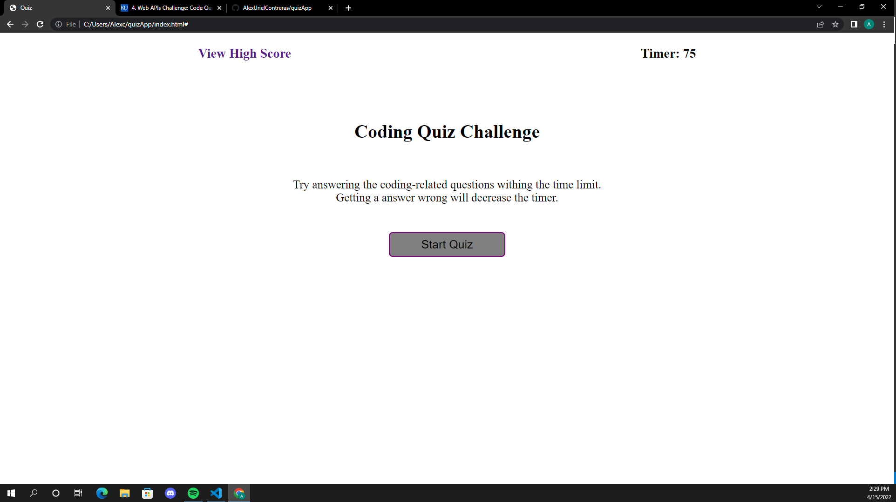
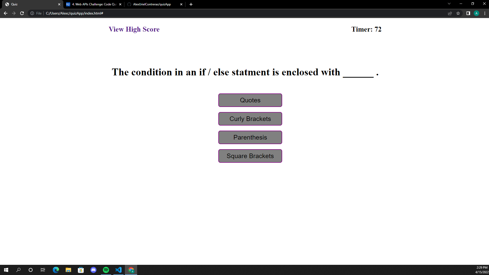
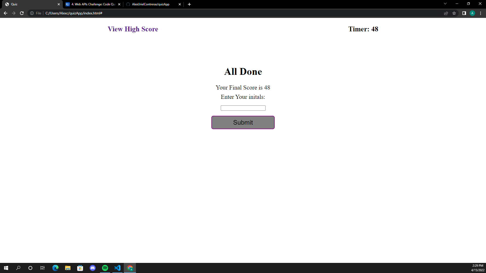
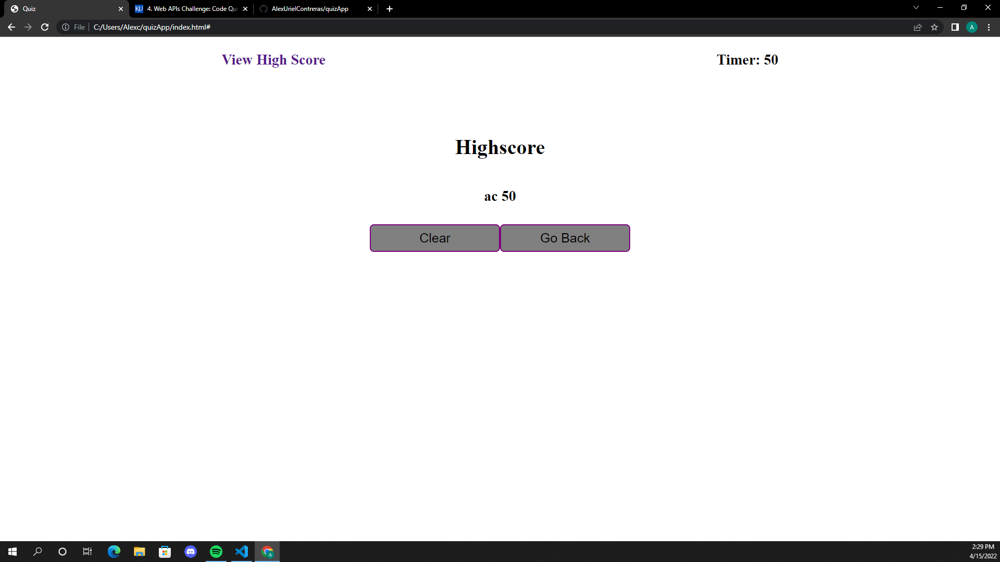

# Quiz App

# Table of Content
[Description](#description) 
[Links](#links) 
[Technology's Used](#technologys-used) 
[ScreenShots](#screenshots)

## Description
When a user presses start quiz they are present with a timed quiz.  
During the quiz user will be punsihed for answering wrong, User will lose 10 sec off the time for every question answered incorrecly. 
Completing the quiz, User will then be prompted to enter and submit their initails. 

## Links
Link to Deployed Github Page: <a href="https://alexurielcontreras.github.io/quizApp/">Quiz Page</a> 
Link to Github Repo: <a href="https://github.com/AlexUrielContreras/quizApp">GitHub Repo</a>

## Technology's Used
<ul>
    <li>HTML</li>
    <li>CSS</li>
    <li>JavaScript</li>
</ul>

## ScreenShots
 
 
 
 